<p align="center">
  
</p>

<p align="center">
  
</p>

<p align="center">
  <a href="https://git.io/typing-svg">
    
  </a>
</p>

<p align="center">
  <a href="https://github.com/GAURAV2234"></a>
  <a href="https://www.linkedin.com/in/gaurav-gupta-83440924b/"></a>
  <a href="mailto:gauravgg.74.gg@gmail.com"></a>
  <a href="https://gaurav2234.github.io/Portfolio.github.io/"></a>
  <a href="https://x.com/GuptaG010"></a>
</p>

<p align="center">
  
  
  
</p>

<p align="center">
  
</p>

## 🧑‍💻 About Me

```yaml
name: "Gaurav Gupta"
role: "B.Tech CSE (Artificial Intelligence & Machine Learning)"
university: "SRM Institute of Science and Technology (SRMIST), KTR Campus"
cgpa: "9.46 / 10"
location: "Chennai, Tamil Nadu, India 🇮🇳"
background: "NCC Naval Wing Cadet ('C' Certificate) · Military family background"
interests:
  - Artificial Intelligence      - Generative AI
  - Machine Learning             - Large Language Models (LLMs)
  - Deep Learning                - Full Stack AI Development
  - Computer Vision              - MLOps & Research
mission: "Building intelligent systems that solve real-world problems."
```

<p align="center">
  
  
  
  
</p>

<p align="center">
  
</p>

## 🛠️ Tech Stack

<h4 align="center">Programming Languages</h4>
<p align="center">
  
  
  
  
  
</p>

<h4 align="center">AI & Machine Learning</h4>
<p align="center">
  
  
  
  
  
  
  
  
  
  
  
  
  
</p>

<h4 align="center">Data Science, Backend & Database</h4>
<p align="center">
  
  
  
  
  
  
  
  
  
  
  
</p>

<h4 align="center">CS Fundamentals & Other Tools</h4>
<p align="center">
  
  
  
  
  
</p>

<p align="center">
  
</p>

<p align="center">
  
</p>

## 🚀 Featured Projects

<table>
<tr>
<td width="50%" valign="top">

### 🎙️ The Matrix — Voice-Based AI Feedback System
Voice-based student feedback platform that captures, transcribes, and analyzes real-time verbal feedback for faculty and administrators.

    

**Key Features**
- Real-time voice-to-text transcription & analysis
- LLM + RAG pipeline for actionable feedback insights
- Built with privacy, scalability & transparency in mind

🔗 `github.com/GAURAV2234/the-matrix` <!-- Replace with actual repo link -->

</td>
<td width="50%" valign="top">

### 🔬 Weld Defect Detection & Segmentation (DRDO)
Deep learning pipeline for detecting and segmenting weld defects in defense-grade manufacturing, built during a DRDL (DRDO) research internship.

   

**Key Features**
- Transformer + U-Net hybrid segmentation architecture
- Image annotation, preprocessing & augmentation pipeline
- Benchmarked with Precision, Recall, F1-score & mAP

🔗 `github.com/GAURAV2234/weld-defect-transunet` <!-- Replace with actual repo link -->

</td>
</tr>
<tr>
<td width="50%" valign="top">

### 🧠 DocMind — Offline Document Intelligence
Privacy-first, fully offline AI system enabling secure document Q&A using a locally hosted LLM — built for legal, academic & healthcare domains.

   

**Key Features**
- 100% offline inference — no internet or external APIs
- Vector search via Sentence Transformers + ChromaDB
- Secure document parsing (PyPDF) for sensitive domains

🔗 `github.com/GAURAV2234/docmind` <!-- Replace with actual repo link -->

</td>
<td width="50%" valign="top">

### 🛡️ Web-Authenticity Checker
Flask-based web app that analyzes structural & behavioral URL patterns to flag suspicious links and assess trustworthiness.

   

**Key Features**
- Server-side URL pattern & structural analysis
- Input validation and secure coding practices
- MySQL-backed persistence layer

🔗 `github.com/GAURAV2234/web-authenticity-checker` <!-- Replace with actual repo link -->

</td>
</tr>
<tr>
<td width="50%" valign="top">

### 🖼️ Pixel Harbor
Python GUI application consolidating multiple digital image processing operations into a single unified platform.

  

**Key Features**
- Multiple image-processing tools in one interface
- Removes need for switching between separate tools
- Focused on accessibility & efficiency

🔗 `github.com/GAURAV2234/pixel-harbor` <!-- Replace with actual repo link -->

</td>
<td width="50%" valign="top">

### 👥 Team Builder AI
Android application that intelligently matches students/professionals into teams using AI-based compatibility scoring.

   

**Key Features**
- AI-driven team compatibility matching
- Firebase-backed real-time data sync
- Modern UI built with Jetpack Compose

🔗 `github.com/GAURAV2234/team-builder-ai` <!-- Replace with actual repo link -->

</td>
</tr>
</table>

<p align="center"><i>📌 Replace the placeholder repo links above with your actual GitHub repository URLs.</i></p>

<p align="center">
  
</p>

## 💼 Experience

```text
Jun 2025 – Jul 2025  ── AI/ML Research Intern — DRDL, DRDO (AI Division), Telangana
        • Built weld-defect detection & segmentation models using ANN, CNN, YOLOv7/YOLOv11 and TransUNet
        • Annotated datasets in LabelMe; applied preprocessing & augmentation to improve model accuracy
        • Benchmarked models using Precision, Recall, F1-score & mAP for real-time deployment readiness

Jun 2024 – Jul 2024  ── AI & ML Intern — PRAG Group of Industries, Lucknow
        • Built an AI-powered file retrieval module using TF-IDF & Random Forest
        • Applied Python, NLP and supervised learning for automated text classification
        • Delivered an end-to-end retrieval system, improving accuracy & speed

Jun 2024 – Aug 2024  ── IT / Computer Engineer Intern — Gaurav Sanjivani Technicals, Lucknow
        • Handled system troubleshooting, software installs, automation scripting & network configuration
        • Built and shipped a company website page; documented IT processes & workflows
```

## 📚 Research & Publications

**📄 ICVGIP 2024 — ViDAS: Vision-based Danger Assessment and Scoring**
Research contribution accepted at the Indian Conference on Vision, Graphics and Image Processing.

**📖 Book Chapter (Co-authored) — *Emotionally Intelligent AI Assistant Powered by Machine Learning and NLP***
Published by Scrivener Publishing.

**Research Interests:** Computer Vision · Medical AI · Large Language Models · Generative AI · Human-AI Interaction

## 📜 Certifications

<p align="center">
  
  
</p>

## 🎖️ Leadership

- 🏛️ **Discipline Convenor** — Directorate of Student Affairs, SRMIST *(Sep 2024 – Apr 2025)*
- 🎉 **Head of Event Management** — CINTEL Student Association, SRMIST *(Feb 2024 – Present)*
- ⚓ **Naval Wing Cadet** — NCC, 'C' Certificate (highest grade) *(Sep 2022 – Feb 2025)*

<p align="center">
  
</p>

## 🏆 Achievements

<div align="center">

| 🏆 Achievement |
|---|
| Top 20 Student — **ANU Australia's Future Research Talent Program** |
| Published Research — **ICVGIP 2024 (ViDAS)** |
| Co-authored Book Chapter — **Scrivener Publishing** |
| 🥇 **CodeFest Winner** |
| ✅ **260+ DSA Problems Solved** |
| 🎓 **JEE (2022) — 84.35 Percentile** |
| 🎖️ **NCC 'C' Certificate (Naval Wing)** |

</div>

## 🎯 Beyond the Code

<p align="center">
  
  
  
  
</p>

<p align="center">
  
</p>

## 📊 GitHub Stats

<p align="center">
  
  
</p>

<p align="center">
  
  
</p>

<!-- The stats & top-langs cards above are generated by the readme-cards.yml GitHub Action
     and committed to ./profile/ in this repo — they no longer depend on the shared public
     github-readme-stats.vercel.app server, so they won't show broken-image icons anymore. -->

<p align="center">
  
</p>

<details>
<summary>✨ Bonus: self-hosting the trophy card too, and the 3D isometric contribution calendar</summary>

**🏆 Trophy card** — currently uses the public `github-profile-trophy.vercel.app`, which can occasionally break the same way stats/top-langs did. A self-hosted Action exists but is newer/less mature than the stats one — worth revisiting later if it keeps breaking.

**🧊 3D / Isometric contribution calendar**
1. Add the workflow from [`yoshi389111/github-profile-3d-contrib`](https://github.com/yoshi389111/github-profile-3d-contrib) to your profile repo.
2. It auto-generates a rotating 3D contribution graph SVG/GIF on a schedule.
3. Embed the generated image path once it's live in your repo's `profile-3d-contrib` folder.

</details>

<p align="center">
  
</p>

## 🌱 Current Focus

```yaml
learning:    Advanced RAG architectures, LoRA fine-tuning, MLOps pipelines
working_on:  Voice-based AI feedback system, Computer Vision research projects
researching: Vision-based danger assessment, Medical AI applications
exploring:   Multi-modal LLMs, Agentic AI workflows
```

## 🤝 Open Source

I'm actively looking to contribute to open-source projects in **AI/ML, Computer Vision, and NLP**. If you're maintaining a project and could use a hand, feel free to reach out!

<p align="center">
  
</p>

## 📫 Connect With Me

<p align="center">
  <a href="https://github.com/GAURAV2234"></a>
  <a href="https://www.linkedin.com/in/gaurav-gupta-83440924b/"></a>
  <a href="mailto:gauravgg.74.gg@gmail.com"></a>
  <a href="https://gaurav2234.github.io/Portfolio.github.io/"></a>
  <a href="https://x.com/GuptaG010"></a>
</p>

<p align="center">
  
</p>

## ☕ Fun Zone

<p align="center">
  
</p>

### 🐍 Contribution Snake

<p align="center">
  
</p>

<p align="center">
  
</p>

<p align="center">
  
</p>

<!-- Spotify widget placeholder — set up via https://github.com/kittinan/spotify-github-profile -->
<p align="center">
  
</p>

<p align="center">
  
</p>

<h3 align="center">Thanks for visiting my profile! ⭐ from you would mean a lot. 🚀</h3>

<!--
=====================================================
📌 SETUP CHECKLIST — still to replace:
1. Repo links under "Featured Projects" -> your actual repo URLs
2. Spotify widget -> your own handle, or delete those lines
3. Fun Zone interactive widget -> once we settle on a style (see chat)
4. Snake animation & 3D contribution graph -> see the collapsible "Bonus animated widgets"
   section above for one-time GitHub Action setup steps
5. Place this file in a repo named exactly "GAURAV2234"
   (must match your GitHub username) for it to show on your profile
=====================================================
-->
